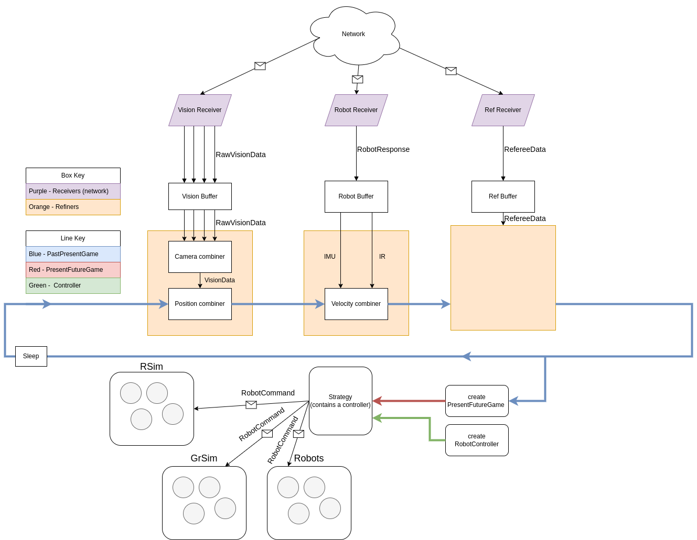

## Pipeline Method Explanation

### Problem: 
- When ingesting new data, we may want to combine this new data with our previous knowledge eg, Kalman filter. Currently this requires writing many new functions in the Game object making it bloated.
- Interface for accessing past, current and future (predictions) is not uniform
- Uncertainty on strategies which we aim to address with the Behaviour Tree 
  
### System diagram

### Solution
Solve this by maintaining the idea that the game represents everything we have about the "true current state" of the game but allow it to be passed through a pipeline in which it is repeatedly augmented by new data. 

The pipeline is composed of Refiner operators which take the current game state and a new datapoint, and return an updated game state.

Later pipeline stages use the game from earlier pipeline stages, so it sees earlier updates in the game. For example the has_ball refiner uses the IR data for our own robots and the positions in game for the enemy robots (and so the position refiner happens first in the pipeline). This illustrates the idea that we try to make everything as equal as possible for enemy and friendly robots (both have has_ball for example) but generate estimates using different data sources.  

We think this method resolves all of the concerns: 
 - How and where to combine multiple cameras? We have a camera combiner inside the position refiner which does this.

 - What if we get behind and need to drop frames? We've replaced the queues with 1 place buffers and we run the main loop at a fixed frame rate, taking the latest data available from every camera, the robot and the referee once per frame.
 -  Frame Limiting - Done through the concept of buffers
Estop - Done by a field in game
Current Vel cacls - Done by a field in game 
Prediction - handled by predictors
Game gating - See diagram
Concurrency - deque is thread safe

### Key system points
- Main loop is now a fixed frequency
- Game is immutable
- Separation of receivers (network) and refiners allow easier testing 
- Formalisation of Past, Present, Future games
- Strategies use PresentFutureGame which allows access to known parameters (robot positions etc),
-  Future game exposes predictions, which are customisable via the Predictions interface.
   -  Allows multiple methods of prediction for the same property, eg velocity from previous velocity, or previous positions
-  Past Game stores historical records, but is hidden from public interface of strategy
   -  Motive: You use the past to predict things, so you should write a predictor
   -  Predictors have access to the past data to make predictions

