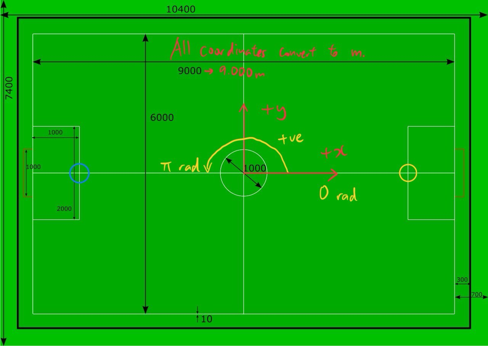

# Utama

## Table of Contents
- [Setup Utama](#setup-utama)
- [Repository Guide](#repository-guide)
- [Setup AutoReferee](#setup-autoreferee)
- [Setup SSL Vision for Real Testing](#setup-ssl-vision-for-real-testing)
- [Field Guide](#field-guide)
- [Milestones](#milestones)

## Setup Utama

1. Install `pixi` package manager with `curl -fsSL https://pixi.sh/install.sh | sh` or click here for Windows installation [Pixi installation](https://pixi.sh/latest/#__tabbed_1_1) 
1. Restart or create a new terminal 
1. With pixi: just run `pixi install` in the base folder and you're all setup.
1. Note that this also installs all modules with `__init__.py` (so you need to run it again when you add an `__init__.py`)
1. In order to go into the `pixi` venv, run `pixi shell`. You can also run any of the tasks in the `pixi.toml` without first being in a pixi shell. See [Pixi Tasks](#pixi-tasks).
1. Finally, run `pixi run precommit-install`. This will ensure that linting is done before you commit.

**Note**
- if you are using the run button and it is selecting the wrong env (robosim) you will need to manually change the interpreter in VScode using `Ctrl + Shift + P` -> `Select Interpreter`.
- if you want to perform a one-off run (ad-hoc) use `pixi run python path/to/your_file.py`.

### Pixi Tasks
`pixi run <task_name>` is the generic way to run a task. Some of the main tasks you can run:
1. `pixi run main` runs main.py
2. `pixi run precommit-install` downloads the precommit hook to ensure that your code is formatted correctly when you commit and push.
3. `pixi run lint` runs the full suite of precommit checkers on all files (You need to run the precommit install task above first).
4. `pixi run tests` runs pytest over the `utama_core/tests/` folder
5. `pixi run replay --replay-file <file_name>` runs the replay file stored in `./replays` folder. If no `--replay-file` flag provided, defaults to latest replay in the folder.

## Repository Guide

### Folder Structure

1. `strategy`: higher level control from above roles to plays and tactics in decision-tree like abstraction
2. `skills`: lowest level of control for individual robots
3. `motion_planning`: control algorithms for movement and path planning
4. `team_controller`: interfacing with vision (including processing) and robots
5. `run`: The logic for main running loop, including refiners and predictors
6. `global_utils`: store utility functions that can be shared across all folders
7. `entities`: store classes for building field, robot, data entities etc.
8. `rsoccer_simulator`: Lightweight rSoccer simulator for testing
9. `replay`: replay system for storing played games in a .pkl file that can be reconstructed in rsoccer sim
10. `tests`: include all unit tests here
11. `config`: configs for the robots (defaults, settings, roles/tactics enums, etc.)

### Code Writing

1. Use typing for all variables.
2. Document your code on the subfolder's `README.md` and wiki.
3. Download and install `Black Formatter` for code formatting

   1. For VScode, go to View > Command Palette and search `Open User Settings (JSON)`
   2. Find the `"[python]"` field and add the following lines:

   ```yaml
   "[python]": {
       "editor.defaultFormatter": "ms-python.black-formatter", # add this
       "editor.formatOnSave": true, # and add this
     }
   ```

### Push and Commit

1. Each feature should live within its own branch of the repository. Clear out stale branches.
2. Ensure that you have run `pixi run precommit-install` at least once. This ensures that the pre-commit steps are run on each commit to clean up your code.
3. If the precommit fails, click on `Open Git Log` on the popup window to view the error. Often times, the failure is automatically fixed and you just need to commit the changes the precommit hook makes.
4. The popup window can often be quite cryptic when it fails. If you are getting a `bash: warning: setlocale: LC_ALL: cannot change locale (en_US.UTF-8)` popup on commit, this is not the actual cause of the failure. However, Windows decides to show this warning, because it is first warning in the output. To silence this:
```bash
sudo apt-get update
sudo apt-get install -y locales
sudo locale-gen en_US.UTF-8
sudo update-locale LANG=en_US.UTF-8
source ~/.bashrc
```

### Making a PR
For a PR to be accepted, it must:
1. have a `release` tag assigned, either `release:major`, `release:minor`, or `release:patch`.
2. Pass all CI checks, both tests and linting.
3. Not be branched from a stale version of main. Remember to update the PR:
```bash
git checkout main
git checkout <your_branch>
git merge main
```
4. have all Copilot comments reviewed (Not all must be addressed: Copilot makes mistakes too, so don't blindly accept!)
5. have at least one tick from an assigned reviewer

## Setup AutoReferee

1. Make sure `grSim` is setup properly and can be called through terminal.
2. `git clone` from [AutoReferee repo](https://github.com/TIGERs-Mannheim/AutoReferee) in a folder named `/AutoReferee` in root directory.
3. Change `DIV_A` in `/AutoReferee/config/moduli/moduli.xml` to `DIV_B`.

```xml
    <globalConfiguration>
        <environment>ROBOCUP</environment>
        <geometry>DIV_B</geometry>
    </globalConfiguration>
```

4. Get the latest [compiled game controller](https://github.com/RoboCup-SSL/ssl-game-controller/releases/) and rename it to `ssl_game_controller`. Save it in `/ssl-game-controller` directory.

## Setup SSL Vision for Real Testing

1. Connect to an external hotspot and ensure both the vision Linux laptop and your personal laptop are connected to the same network.
2. Allow inbound UDP packets through the port you set. Run the following command with admin privileges:
<pre>
New-NetFirewallRule -DisplayName "Allow Multicast UDP 10006" -Direction Inbound -Protocol UDP -LocalPort 10006 -Action Allow
</pre>
3. Type "%USERPROFILE%" into "Windows + R", then add a `.wslconfig` file. Ensure that the file type is set to WSLCONFIG.
<pre>
[wsl2]
networkingMode=mirrored
</pre>
4. Restart WSL using `wsl --shutdown`, then check the connection using the following command:
<pre>
sudo tcpdump -i eth1 -n host 224.5.23.2 and udp port 10006
</pre>
If you see UDP packets, everything is working.

## Field Guide



1. All coordinates and velocities will be in meters or meters per second.
2. All angular properties will be in radians or radians per second, normalised between [pi, -pi]. A heading of radian 0 indicates a robot facing towards the positive x-axis (ie left to right).
3. Unless otherwise stated, the coordinate system is aligned such that blue robots are on the left and yellow are on the right.

## Milestones

- 2024 November 20 - First goal in grSim (featuring Ray casting)
