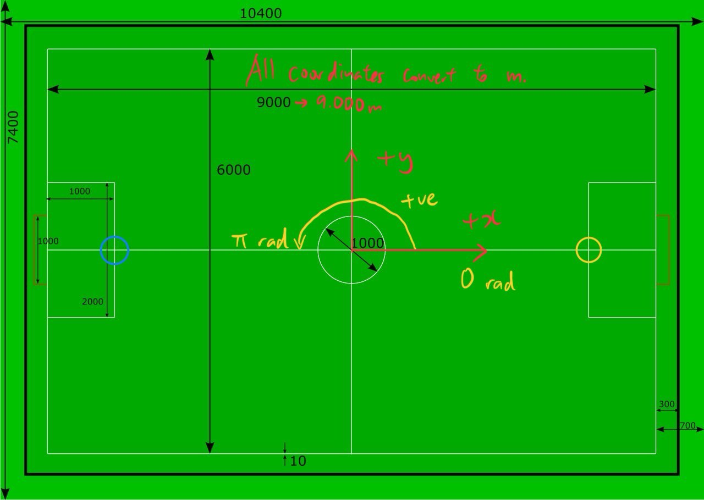
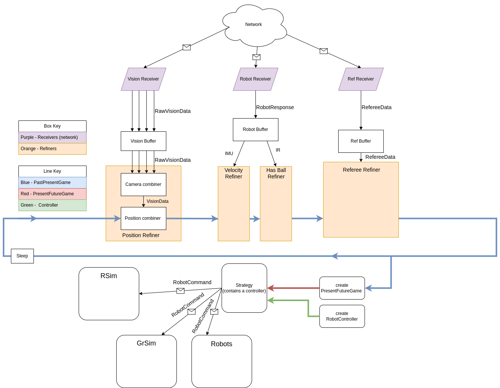

# Utama Core

First Order Robotics' software stack for [RoboCup SSL](https://ssl.robocup.org/) (Small Size
League), where teams of six autonomous robots play football. It covers vision and referee
input, motion planning, robot control, an in-process referee, a fast simulator (rsim), and the
strategy layer that decides what every robot does.

## Quick start

1. Install [pixi](https://pixi.sh/latest/#installation)
   (`curl -fsSL https://pixi.sh/install.sh | sh`) and open a new terminal.
2. `pixi install` in the repository root, then `pixi run precommit-install` so every commit is
   linted.
3. `pixi run test` runs the test suite (add `--headless` when calling pytest directly).
4. Play one headless match between two strategies and save its replay:

       pixi run python tools/tournament/round_robin.py --pair tiki_taka low_block

5. `pixi run python dashboard_server.py` and open http://localhost:8080 to watch replays and
   browse tournament results.

Everything runs in rsim with the in-process referee; grSim, the official GameController and
real robots are optional ([external setup](docs/setup_external.md)).

## What are you working on?

| Task | Start here |
|---|---|
| Writing or changing a strategy, tactic or skill | [docs/STRATEGY_DEVELOPMENT.md](docs/STRATEGY_DEVELOPMENT.md), [docs/strategies.md](docs/strategies.md) |
| Judging whether a strategy is better | [docs/STRATEGY_DEVELOPMENT.md](docs/STRATEGY_DEVELOPMENT.md), [docs/signals.md](docs/signals.md), [docs/signal_report.md](docs/signal_report.md) |
| The referee | [docs/custom_referee.md](docs/custom_referee.md) |
| Motion planning | [docs/motion_planning_comparison.md](docs/motion_planning_comparison.md) |
| The simulator | [vendor/rSim/FORK_NOTES.md](vendor/rSim/FORK_NOTES.md) |
| Real robots, vision, radio | [utama_core/team_controller/README.md](utama_core/team_controller/README.md), [docs/setup_external.md](docs/setup_external.md) |
| Which script does what | [docs/tools.md](docs/tools.md) |
| Everything else | [docs/README.md](docs/README.md), the index of every doc |

Coding agents: read [AGENTS.md](AGENTS.md) first (`CLAUDE.md` is a symlink to it).

## Layout

Everything lives under `utama_core/`:

- `strategy/`: the strategies (one module per `build_*_kernel_strategy` factory, re-exported by `kernel_strategy.py`)
- `tactics/`, `skills/`, `shared/`: reusable tactics, per-robot skills, and geometry they share
- `engine/`: the tactic-kernel infrastructure (`Strategy`, `Tactic`, `TickContext`, `MatchLog`, referee overrides)
- `custom_referee/`: the in-process referee (rules, state machine, restart positioning, profiles)
- `motion_planning/`: path planning and motion control
- `run/`: the main loop (`StrategyRunner`)
- `replay/`: replay files, the match-result cache and code fingerprints
- `analysis/`: offline analyses of tournament runs and replays (ball losses, chances, restarts, stalls)
- `scenario_bench/`: the scenario bench's starts, banks, harvester and scorer
- `rsoccer_simulator/`: the Python simulator environment over the rSim physics fork in `vendor/rSim/`
- `team_controller/`, `data_processing/`: vision, robot radio and referee input
- `dashboard/`: the browser dashboard
- `entities/`, `config/`, `global_utils/`: data classes, settings and constants, utilities
- `tests/`: all tests

Scripts live in `tools/` (tournaments in `tools/tournament/`) and `examples/`; see
[docs/tools.md](docs/tools.md).

## Field conventions

- Distances in metres, velocities in metres per second.
- Angles in radians, normalised to [-pi, pi]; heading 0 faces the positive x-axis (left to right).
- The centre of the field is (0, 0). Unless stated otherwise, blue defends the left and yellow
  the right.

## System design

How vision, robot and referee data become one `Game` state: [docs/pipeline_method.md](docs/pipeline_method.md).

## Contributing

Work on a branch and open a pull request into `main`. A pull request needs:

1. a `release:major`, `release:minor` or `release:patch` label: every merge to `main` releases
   a new version automatically;
2. passing CI (tests and lint; `pixi run test` and `pixi run lint` locally);
3. to be up to date with `main`;
4. every Copilot comment reviewed (not necessarily accepted);
5. an approval from an assigned reviewer.

Editor setup, pre-commit troubleshooting and the pixi environments: [docs/contributing.md](docs/contributing.md).

## Milestones

- 2024 November 20 - First goal in grSim (featuring ray casting)
