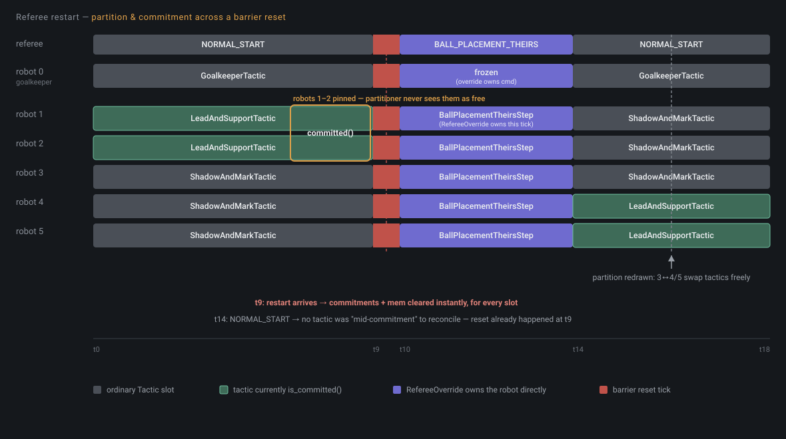

# Strategy = Tactics × Orchestration

We build software for RoboCup Small Size League robots — six autonomous robots a side,
playing soccer, at a scale where "the strategy layer" has to decide, sixty times a second,
what every robot on the field is doing. This post is about the architecture we landed on
for that decision, and why splitting it into two orthogonal pieces — *tactics* and
*orchestration* — turned out to matter more than either piece alone.

## The model

A **`Tactic`** is a small, self-contained unit of coordinated behavior for a *group* of
robots: a give-and-go, a press-and-contain, a defensive wall. Its interface, in full:

```python
class Tactic(Protocol[MemT]):
    tag: TacticTag  # ATTACK / DEFENSE / MIXED — what role this tactic plays

    def initial_mem(self) -> MemT:
        """Fresh state, created whenever this tactic's robot assignment changes."""

    def tick(
        self, game: Game, ctx: TickContext, robot_ids: tuple[RobotId, ...], mem: MemT
    ) -> tuple[dict[RobotId, RobotCommand], MemT]:
        """Compute this tick's commands for `robot_ids`, and the next `mem`."""

    def applicable(self, game: Game) -> bool:
        """Is it sensible for this tactic to *begin* running right now? Default: True."""

    def is_committed(self, game: Game, mem: MemT) -> bool:
        """Must the scheduler leave this tactic's robots alone right now? Default: False."""

    def suggest_next(self, game: Game, mem: MemT) -> Optional[TacticId]:
        """Purely advisory: what should run next, if anything. Default: no opinion."""
```

`tick()` is the only method a tactic *must* implement — everything else defaults to
permissive, so a minimal tactic is one method long. Handed a game snapshot, a tick context,
the specific robots it owns *this tick*, and whatever state it carried from last tick, it
returns commands and its next state. No inheritance required, no base class to extend —
just an object shaped like this. A tactic doesn't know or care how many other tactics exist,
what they're doing, or how it ended up with the robots it has.

A **`Strategy`** is the piece that decides *that*. Its core loop, simplified:

```python
class Strategy:
    def __init__(self, tactics: dict[TacticId, Tactic], partitioner: Partitioner, ...):
        ...

    def tick(self, game: Game) -> dict[RobotId, RobotCommand]:
        partition = self._choose_partition(game)  # pinned (committed) slots + partitioner's picks
        commands = {}
        for tactic_id, robot_ids in partition.items():
            slot = self._slot_for(tactic_id)
            slot_commands, slot.mem = slot.tactic.tick(game, self._ctx, robot_ids, slot.mem)
            commands.update(slot_commands)
        return commands
```

where a `Partitioner` is a plain function:

```python
Partitioner = Callable[
    [Game, frozenset[RobotId], Optional[dict[TacticId, frozenset[RobotId]]], frozenset[TacticId]],
    dict[TacticId, frozenset[RobotId]],
]
```

Every tick, before any tactic runs, the partitioner looks at the game state, the pool of
*free* robots (excluding any currently `is_committed()`), and the previous partition, and
decides how to split the free pool across tactic slots. One tactic might get two robots this
tick, none the next; a new tactic might spin up mid-possession; another might quietly stop
being handed anyone. The strategy layer runs however many tactics the partition calls for,
concurrently, each ticking against only the robots it was just assigned.

The split is the whole idea: **a `Tactic` never decides who's on it, and a `Strategy` never
decides what a group of robots does once assigned to one.** Multiplying those two concerns
together — a tactic's behavior, times an orchestration decision about group membership —
is what produces the actual play on the field. Change the orchestration and keep the same
tactics, and you get a different team shape from the same building blocks. Change a tactic
and keep the same orchestration, and every formation that uses it inherits the fix at once.

## What falls out of decoupling them



Read left to right: through `NORMAL_START`, robots 1–2 are running `LeadAndSupportTactic`
and it has marked itself `is_committed()` — the partitioner never sees them as free, no
matter what else changes. At t9 a referee restart arrives and triggers a **barrier reset**:
every slot's commitment and `mem` are cleared unconditionally, for every robot at once,
including 1–2 — a restart makes the previous tick's in-progress action moot for everyone,
not just whoever wasn't committed. For the duration of `BALL_PLACEMENT_THEIRS`,
`RefereeOverride` — not any `Tactic` — owns every outfield robot directly, running the
restart's own positioning step. Once `NORMAL_START` resumes at t14, the partitioner is
simply asked again: robots 3–5 reshuffle freely (nothing there was ever committed), and
there's no "was anything mid-commitment when the restart hit" case to reconcile, because
the barrier reset already handled that five ticks earlier.

Three things fall out of this for free, without any of them being designed as a special
case: **regrouping is just the partitioner running again** (two active tactics becoming
one or three needs no dedicated transition — it's the ordinary consequence of the free pool
changing tick to tick); **safety needs no locks** (the whole partition is fixed before any
tactic ticks, so two tactics can never contend for a robot mid-tick, and `is_committed()`
gives a tactic an absolute, self-declared veto over being reassigned mid-action, cleared
only on a referee restart); and **tactics compose without coordinating** (a new tactic drops
in against the same `tick()` shape, with no shared state machine or priority table to update,
and every existing tactic keeps working unmodified since `applicable()`/`is_committed()`
default permissively).

## The OS scheduler analogy

If this shape feels familiar, it's on purpose. It's the same split an operating system
makes between *processes* and the *scheduler* on a multi-core CPU. A process doesn't know
how many cores exist, which core it's running on, or when it'll be preempted — it just
computes, given whatever time slice and core it's handed. The scheduler doesn't know or
care what a process actually does internally; it only ever reasons about which processes
get which cores, for how long, and under what constraints (priority, affinity, a lock held
that can't be safely preempted).

A `Tactic` is a process: it runs, given a slice of the shared resource (robots, not cores),
with no visibility into the scheduling decision that put it there. `Strategy` is the
scheduler: it never looks inside a tactic's logic, only at the tactic-level metadata it's
allowed to ask about — `applicable()` (can this be scheduled at all right now),
`is_committed()` (does it hold something like a lock it can't be preempted out of), and
`suggest_next()` (a cooperative yield hint, not unlike a process signaling it's about to
finish). The single-writer partition invariant is exactly a scheduler's guarantee that two
processes never get handed the same core at once — the concurrency-safety property comes
from the same place an OS's does: one authority decides the whole allocation before anything
runs, not from locks negotiated between the things being scheduled.

## Future directions

Two independent axes to push on next, and it's worth being clear they're independent:
better *tactics* and better *orchestration* are separate improvements, exactly because the
model keeps them decoupled.

**More tactics** is the straightforward axis — more plays, more set-piece responses, more
specialized behavior for situations the current roster handles generically. Every new
tactic is additive: it slots into the existing `Tactic` protocol, and no partitioner has to
change to accommodate it unless it should specifically prefer the new one.

**Better orchestration** is the more open one. Today's partitioners are hand-written
if/else logic over game state — auditable, predictable, and easy to reason about, but
fundamentally a human asserting "in this situation, split the robots this way" rather than
anything derived or learned. A few directions worth exploring, roughly in order of how much
they change the model:

- **Fitness vectors.** Instead of (or alongside) hand-written if/else branches, let each
  tactic optionally score how well it thinks it'd do with a given candidate group of robots
  — a named vector (`{"ball_proximity": 0.8, "formation_risk": 0.2}`), not a single opaque
  number, so each criterion stays individually inspectable and testable. The partitioner
  then collapses competing tactics' vectors into a decision via some explicit policy —
  weighted sum, strict lexicographic ordering (defense always wins ties with offense, say),
  or lexicographic-with-tolerance so close scores don't get forced apart by an arbitrary
  priority order. This only matters where tactics are genuinely competing for the same
  marginal robot; it's overkill anywhere the split is already obvious.
- **Graph-based scheduling.** Tactics already have an optional, purely-advisory
  `suggest_next()` hook — a tactic that knows it's about to finish can name what it thinks
  should run next. Nothing currently *uses* that signal; a partitioner built around chaining
  these hints into an explicit graph (this tactic's likely successors, and theirs) is a
  fundamentally different orchestration shape from today's flat if/else, closer to a
  planner than a classifier.
- **Learned scheduling.** The far end of the same axis: replace the hand-written or
  hand-scored partitioner with something trained against real match outcomes — a model that
  looks at game state and a candidate partition and predicts how good it is, rather than a
  human asserting it. The action space stays small and enumerable (a handful of robots
  across a bounded set of tactics), which keeps this more tractable than it sounds, but it
  trades away the auditability of "just read the if/else" for something that needs its own
  validation story before anyone trusts it in a real match.

None of these require touching what a `Tactic` looks like at all — every one of them is a
different `Partitioner`, which is exactly the point of keeping the two sides of this
multiplication independent in the first place.
