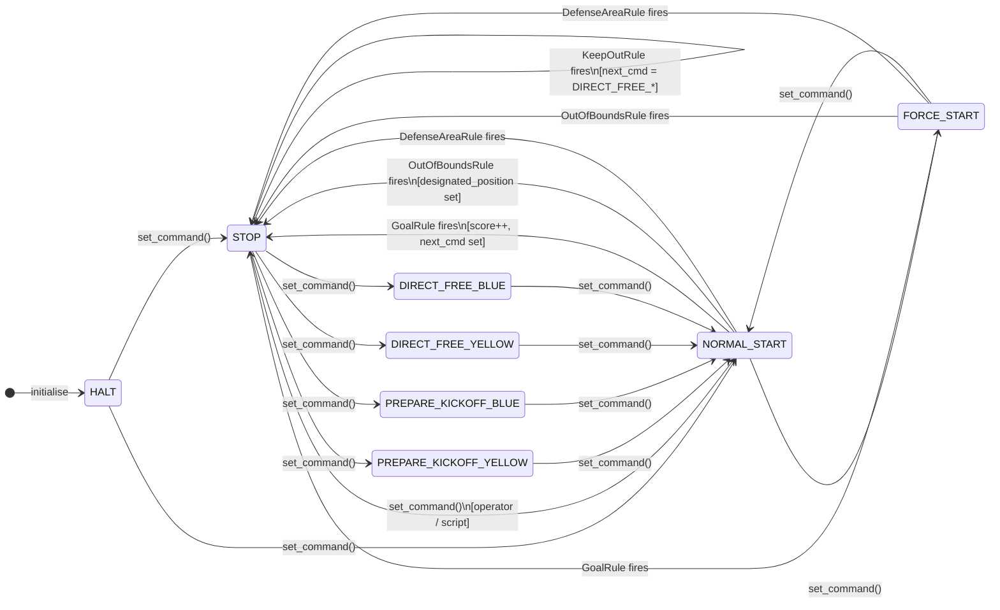

# Custom Referee

The `CustomReferee` is an in-process, mode-agnostic referee that operates on `GameFrame` objects and produces `RefereeData` — the same type consumed by the behaviour tree's `CheckRefereeCommand` nodes. It requires no network connection, no AutoReferee process, and no simulator-specific code. It works identically across RSim, grSim, and Real modes.

---

## Why a Custom Referee?

The official [TIGERs AutoReferee](https://github.com/TIGERs-Mannheim/AutoReferee) is a Java process that broadcasts UDP multicast packets. It works well in Real and grSim modes but is not usable in RSim (no AutoReferee process is running) and is impractical for RL training (asynchronous, real-time only, can't step faster than 60 Hz).

The `CustomReferee` addresses three specific use cases:

**1. RSim / RL training**
RSim runs as fast as the CPU allows. The custom referee steps synchronously in the same Python process, so there is no network latency or synchronisation overhead. You can train at 10 000× real-time.

**2. Custom field geometry**
The official AutoReferee has hardcoded thresholds (defence area size, keep-out radius) that break on small physical test fields. `RefereeGeometry` is a frozen dataclass you configure per-deployment — shrink the defence area, tighten or loosen the keep-out radius, disable rules entirely.

**3. Exhibition and arcade game modes**
Strict SSL rules (double-touch, ball speed, keep-out distance) ruin human-vs-robot exhibition matches because humans constantly trigger fouls. Profile-based configuration lets you switch rule sets without touching code.

---

## Architecture

```
CustomReferee
├── RefereeGeometry          # frozen field dimensions (configurable)
├── list[BaseRule]           # ordered rule checkers (first match wins)
│   ├── GoalRule
│   ├── OutOfBoundsRule
│   ├── DefenseAreaRule
│   └── KeepOutRule
└── GameStateMachine         # mutable command / score / stage state
```

### Data flow per tick

```
GameFrame (ball + robots + ts)
        │
        ▼
CustomReferee.step(game_frame, current_time)
        │
        ├─► for each BaseRule (in priority order):
        │       rule.check(game_frame, geometry, current_command)
        │       → Optional[RuleViolation]       first match wins
        │
        ▼
GameStateMachine.step(current_time, violation)
        │
        ├─► if violation and not in cooldown (0.3 s):
        │       goal   → increment score, set STOP, set next_command,
        │                set designated_position = (0.0, 0.0)
        │       foul   → set suggested_command, set next_command, set designated_position
        │
        ▼
RefereeData  (source_identifier="custom_referee")
```

The one-frame lag (the `GameFrame` used is from the previous step) is acceptable and matches how the existing RSim `RefereeStateMachine` works.

---

## State Machine

The `GameStateMachine` owns all mutable state: command, score, stage, and next command. It does **not** auto-advance from `STOP` to `NORMAL_START` — that transition is always explicit (operator input or a fixed-delay script). This keeps control predictable.



> **Key design principle:** `CustomReferee` only ever *moves into* `STOP` automatically. All transitions *out of* `STOP` require an explicit `set_command()` call. This matches how a human operator interacts with a real game controller.

### Transition cooldown

A 0.3 s cooldown (`_TRANSITION_COOLDOWN`) prevents the same violation from being applied multiple times in quick succession (e.g., the ball briefly in the goal for several frames).

---

## Rule Checkers

Each rule is a `BaseRule` subclass. Rules are evaluated in priority order; the **first match wins** and subsequent rules are skipped for that tick.

### Priority order

| Priority | Rule | Active during |
|----------|------|---------------|
| 1 | `GoalRule` | `NORMAL_START`, `FORCE_START` |
| 2 | `OutOfBoundsRule` | `NORMAL_START`, `FORCE_START` |
| 3 | `DefenseAreaRule` | `NORMAL_START`, `FORCE_START` |
| 4 | `KeepOutRule` | `STOP`, `DIRECT_FREE_*`, `PREPARE_KICKOFF_*`, `PREPARE_PENALTY_*` |

### GoalRule

Detects when the ball crosses the goal line within the goal posts. Uses `game_frame.my_team_is_right` and `game_frame.my_team_is_yellow` to determine which team scored — not a hardcoded assignment.

```
yellow_is_right = (my_team_is_right == my_team_is_yellow)

ball in right goal:
    yellow_is_right=True  → blue scored  → PREPARE_KICKOFF_YELLOW
    yellow_is_right=False → yellow scored → PREPARE_KICKOFF_BLUE

ball in left goal:
    yellow_is_right=True  → yellow scored → PREPARE_KICKOFF_BLUE
    yellow_is_right=False → blue scored   → PREPARE_KICKOFF_YELLOW
```

A configurable `cooldown_seconds` (default 1.0 s) prevents duplicate detections while the ball sits past the goal line for multiple frames.

### OutOfBoundsRule

Fires when `abs(ball.p.x) > half_length` (not in a goal) or `abs(ball.p.y) > half_width`. Tracks last-touch by:
1. Checking `robot.has_ball` (reliable IR sensor on friendly robots).
2. Falling back to the closest robot within 0.15 m.

The non-touching team receives the `DIRECT_FREE_*`. The `designated_position` is placed 0.1 m infield from the nearest boundary point.

### DefenseAreaRule

Only active during `NORMAL_START` and `FORCE_START`. Checks two conditions:

- **Too many defenders:** more than `max_defenders` (default 1) friendly robots inside their own defence area → opponent gets `DIRECT_FREE_*`.
- **Attacker infringement:** any enemy robot inside the friendly team's defence area → friendly team gets `DIRECT_FREE_*`.

Uses `game_frame.my_team_is_right` to resolve which geometry helper (`is_in_left/right_defense_area`) corresponds to "my" goal.

### KeepOutRule

Only active during stoppages (`STOP`, `DIRECT_FREE_*`, `PREPARE_KICKOFF_*`, `PREPARE_PENALTY_*`). Checks that non-kicking-team robots stay outside a configurable `radius_meters` (default 0.5 m) from the ball.

Uses a persistence counter: a violation is only issued after `violation_persistence_frames` (default 30, ≈ 0.5 s at 60 Hz) **consecutive** frames of encroachment. This avoids false positives from robots passing through the zone.

---

## Geometry

`RefereeGeometry` is a frozen dataclass that decouples the referee from `Field`. It never modifies `Field` constants.

```python
@dataclass(frozen=True)
class RefereeGeometry:
    half_length: float           # metres from centre to goal line
    half_width: float            # metres from centre to sideline
    half_goal_width: float       # half the goal opening width
    half_defense_length: float   # depth of defence area
    half_defense_width: float    # half-width of defence area
    center_circle_radius: float  # keep-out radius for kickoffs
```

Two convenience constructors:

- `RefereeGeometry.from_standard_div_b()` — mirrors `Field` constants exactly (9 m × 6 m field).
- `RefereeGeometry.from_field_bounds(field_bounds)` — derives `half_length`/`half_width` from a `FieldBounds`; uses `Field` constants for goal and defence dimensions.

---

## Profiles

Three built-in YAML profiles select the active rule set. Load by name or file path:

```python
referee = CustomReferee.from_profile_name("strict_ai")
referee = CustomReferee.from_profile_name("/path/to/my_profile.yaml")
```

| Setting | `strict_ai` | `exhibition` | `arcade` |
|---|---|---|---|
| Goal detection | ✅ 1.0 s cooldown | ✅ 1.0 s cooldown | ✅ 1.0 s cooldown |
| Out of bounds | ✅ | ✅ | ❌ |
| Defence area | ✅ max 1 defender | ✅ max 1 defender | ❌ |
| Keep-out radius | ✅ 0.5 m | ✅ 0.2 m | ❌ |
| Force start after goal | ❌ | ❌ | ✅ |
| Half duration | 300 s | 300 s | 300 s |

**`strict_ai`** — Full SSL-compatible rule set. Use for AI-vs-AI training and pre-competition testing.

**`exhibition`** — Looser keep-out radius and no double-touch. Use for human-vs-robot demonstrations where strict rules break flow.

**`arcade`** — Goals only. Everything else disabled, `FORCE_START` issued automatically after `stop_duration_seconds` (default 2 s), and the ball is teleported to centre on the STOP transition. Use for continuous-play human matches (e.g., with physical walls).

### YAML schema

```yaml
profile_name: "strict_ai"
geometry:
  half_length: 4.5
  half_width: 3.0
  half_goal_width: 0.5
  half_defense_length: 0.5
  half_defense_width: 1.0
  center_circle_radius: 0.5
rules:
  goal_detection:
    enabled: true
    cooldown_seconds: 1.0
  out_of_bounds:
    enabled: true
    free_kick_assigner: "last_touch"
  defense_area:
    enabled: true
    max_defenders: 1
    attacker_infringement: true
  keep_out:
    enabled: true
    radius_meters: 0.5
    violation_persistence_frames: 30
game:
  half_duration_seconds: 300.0
  kickoff_team: "yellow"
  force_start_after_goal: false
```

---

## Integration with StrategyRunner

`StrategyRunner` accepts an optional `custom_referee` parameter. When set:

1. `RefereeMessageReceiver` is **not** started (no UDP multicast thread).
2. Each tick, `CustomReferee.step()` is called with `self.my_current_game_frame` and the result is pushed into `ref_buffer` before `_step_game()` reads it.
3. On the **transition edge** into `STOP` (i.e. the first frame the command becomes `STOP`), if `RefereeData.designated_position` is not `None` and a `sim_controller` is present, the ball is teleported to `designated_position` in the simulator. After a goal this is always `(0.0, 0.0)` — the centre spot.

```python
from utama_core.custom_referee import CustomReferee
from utama_core.entities.referee.referee_command import RefereeCommand

referee = CustomReferee.from_profile_name("strict_ai", n_robots_yellow=3, n_robots_blue=3)
referee.set_command(RefereeCommand.NORMAL_START, timestamp=0.0)

runner = StrategyRunner(
    strategy=MyStrategy(),
    my_team_is_yellow=True,
    my_team_is_right=False,
    mode="rsim",
    exp_friendly=3,
    exp_enemy=3,
    custom_referee=referee,
)
runner.run()
```

The same `CustomReferee` instance works unchanged when `mode="grsim"` or `mode="real"` — the referee has no code paths that depend on mode. In `mode="real"` the ball teleport is silently skipped (`sim_controller` is `None`).

### Ball teleport after goal (RSim / grSim)

When a goal is scored the state machine sets `designated_position = (0.0, 0.0)` and issues `STOP`. On the very next `_run_step()` call `StrategyRunner` detects the `NORMAL_START → STOP` edge and calls `sim_controller.teleport_ball(0.0, 0.0)`. This resets the ball to the kick-off spot without any manual operator intervention.

The edge-detection guard (`_prev_custom_ref_command != STOP`) ensures the teleport fires exactly once — not every frame while the game remains in `STOP`.

### Manual command injection (RL / test scripts)

```python
referee.set_command(RefereeCommand.NORMAL_START, timestamp=time.time())
```

This is the standard way to resume play after a stoppage in scripted environments.

---

## Downstream pipeline (unchanged)

`CustomReferee` slots into the existing pipeline without any changes below `StrategyRunner`:

```
CustomReferee.step(game_frame, t)
    → RefereeData (source_identifier="custom_referee")
    → ref_buffer
    → StrategyRunner._run_step reads ref_buffer
    → RefereeRefiner.refine(game_frame, referee_data)
    → game_frame.referee = RefereeData
    → game.referee (via Game.referee property)
    → CheckRefereeCommand reads game.referee.referee_command
    → Behaviour tree reacts
```

---

## File structure

```
utama_core/custom_referee/
├── __init__.py                  # exports CustomReferee, RefereeGeometry
├── custom_referee.py            # CustomReferee — rule loop + orchestration
├── geometry.py                  # RefereeGeometry frozen dataclass
├── state_machine.py             # GameStateMachine — score, command, stage
├── rules/
│   ├── __init__.py
│   ├── base_rule.py             # BaseRule ABC, RuleViolation dataclass
│   ├── goal_rule.py             # GoalRule
│   ├── out_of_bounds_rule.py    # OutOfBoundsRule
│   ├── defense_area_rule.py     # DefenseAreaRule
│   └── keep_out_rule.py        # KeepOutRule
└── profiles/
    ├── __init__.py
    ├── profile_loader.py        # load_profile(name|path) → RefereeProfile
    ├── strict_ai.yaml
    ├── exhibition.yaml
    └── arcade.yaml

utama_core/tests/custom_referee/
├── __init__.py
└── test_custom_referee.py       # 34 unit tests

demo_custom_referee.py           # pygame visualisation (run with pixi run python demo_custom_referee.py)
```

---

## Running tests

```bash
pixi run pytest utama_core/tests/custom_referee/ -v
```

## Running the visual demo

```bash
pixi run python demo_custom_referee.py
```

The demo runs 6 scripted scenes in sequence, each exercising one rule. Controls: `SPACE` pause, `R` restart, `←` / `→` skip scenes.
