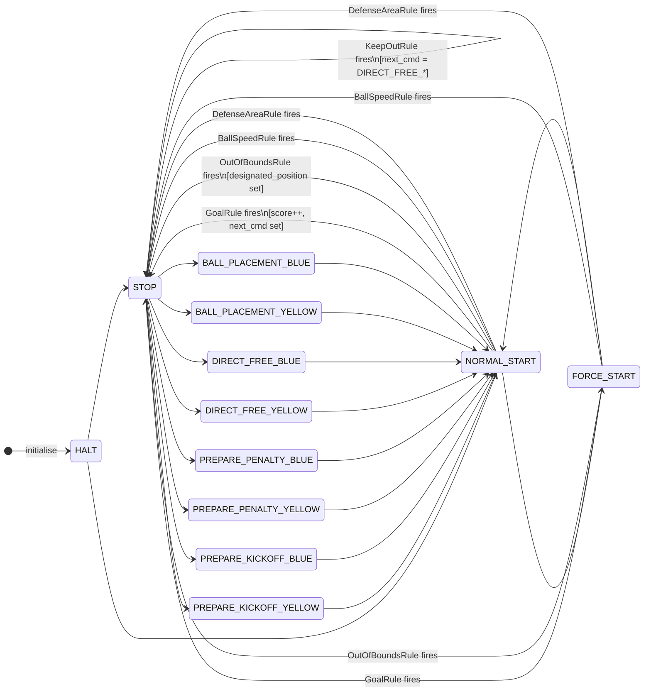

# Custom Referee

The `CustomReferee` is an in-process, mode-agnostic referee that operates on `GameFrame` objects and produces `RefereeData` — read each tick via `game.referee` by `kernel.RefereeOverride` (see `kernel/referee_override.py`) to interrupt tactics during restarts. It requires no network connection, no AutoReferee process, and no simulator-specific code. It works identically across RSim, grSim, and Real modes.

---

## Why a Custom Referee?

The official [TIGERs AutoReferee](https://github.com/TIGERs-Mannheim/AutoReferee) is a Java process that broadcasts UDP multicast packets. It works well in Real and grSim modes but is not usable in RSim (no AutoReferee process is running) and is impractical for RL training (asynchronous, real-time only, can't step faster than 60 Hz).

The `CustomReferee` addresses three specific use cases:

**1. RSim / RL training**
RSim runs as fast as the CPU allows. The custom referee steps synchronously in the same Python process, so there is no network latency or synchronisation overhead. You can train at 10 000× real-time.

**2. Custom field geometry**
The official AutoReferee has hardcoded thresholds (defence area size, keep-out radius) that break on small physical test fields. `RefereeGeometry` is a frozen dataclass you configure per-deployment — shrink the defence area, tighten or loosen the keep-out radius, disable rules entirely.

**3. Exhibition and human game modes**
Strict SSL rules (double-touch, ball speed, keep-out distance) ruin human-vs-robot exhibition matches because humans constantly trigger fouls. Profile-based configuration lets you switch rule sets without touching code.

---

## Architecture

```
CustomReferee
├── RefereeGeometry          # frozen field dimensions (configurable)
├── list[BaseRule]           # ordered rule checkers (first match wins)
│   ├── GoalRule
│   ├── OutOfBoundsRule
│   ├── BallSpeedRule
│   ├── DoubleTouchRule
│   ├── DefenseAreaRule
│   └── KeepOutRule
└── GameStateMachine         # mutable command / score / stage state
```

### Data flow per tick

```
GameFrame (ball + robots + ts)
        │
        ▼
CustomReferee.step(game_frame, current_time)
        │
        ├─► for each BaseRule (in priority order):
        │       rule.check(game_frame, geometry, current_command)
        │       → Optional[RuleViolation]       first match wins
        │
        ▼
GameStateMachine.step(current_time, violation)
        │
        ├─► if violation and not in cooldown (0.3 s):
        │       goal   → increment score, set STOP, set next_command,
        │                set designated_position = (0.0, 0.0)
        │       foul   → set suggested_command, set next_command, set designated_position
        │
        ▼
RefereeData  (source_identifier="custom_referee")
```

The one-frame lag (the `GameFrame` used is from the previous step) is acceptable for all supported modes.

---

## State Machine

The `GameStateMachine` owns all mutable state: command, score, stage, and next command. In the `simulation` profile it can auto-advance from `STOP` into the queued restart command once robots have cleared the ball, then continue through restart-specific readiness checks. In the `human` profile those auto-advances are disabled so an operator stays in control.


```mermaid
stateDiagram-v2
    direction LR

    [*] --> HALT : initialise

    HALT --> STOP
    HALT --> NORMAL_START

    STOP --> PREPARE_KICKOFF_YELLOW
    STOP --> PREPARE_KICKOFF_BLUE
    STOP --> DIRECT_FREE_YELLOW
    STOP --> DIRECT_FREE_BLUE
    STOP --> PREPARE_PENALTY_YELLOW
    STOP --> PREPARE_PENALTY_BLUE
    STOP --> BALL_PLACEMENT_YELLOW
    STOP --> BALL_PLACEMENT_BLUE

    NORMAL_START --> STOP : GoalRule fires\n[score++, next_cmd set]
    NORMAL_START --> STOP : OutOfBoundsRule fires\n[designated_position set]
    NORMAL_START --> STOP : BallSpeedRule fires
    NORMAL_START --> STOP : DefenseAreaRule fires
    FORCE_START --> STOP : GoalRule fires
    FORCE_START --> STOP : OutOfBoundsRule fires
    FORCE_START --> STOP : BallSpeedRule fires
    FORCE_START --> STOP : DefenseAreaRule fires

    STOP --> STOP : KeepOutRule fires\n[next_cmd = DIRECT_FREE_*]

    PREPARE_KICKOFF_YELLOW --> NORMAL_START
    PREPARE_KICKOFF_BLUE --> NORMAL_START
    PREPARE_PENALTY_YELLOW --> NORMAL_START
    PREPARE_PENALTY_BLUE --> NORMAL_START
    DIRECT_FREE_YELLOW --> NORMAL_START
    DIRECT_FREE_BLUE --> NORMAL_START
    BALL_PLACEMENT_YELLOW --> NORMAL_START
    BALL_PLACEMENT_BLUE --> NORMAL_START

    NORMAL_START --> FORCE_START
    FORCE_START --> NORMAL_START
```

> **Key design principle:** profile choice controls restart ownership. `simulation` auto-progresses through queued restarts when readiness checks are satisfied; `human` keeps those transitions manual for operator control.

### Transition cooldown

A 0.3 s cooldown (`_TRANSITION_COOLDOWN`) prevents the same violation from being applied multiple times in quick succession (e.g., the ball briefly in the goal for several frames).

---

## Rule Checkers

Each rule is a `BaseRule` subclass. Rules are evaluated in priority order; the **first match wins** and subsequent rules are skipped for that tick.

### Priority order

| Priority | Rule | Active during |
|----------|------|---------------|
| 1 | `GoalRule` | `NORMAL_START`, `FORCE_START` |
| 2 | `OutOfBoundsRule` | `NORMAL_START`, `FORCE_START` |
| 3 | `BallSpeedRule` | `NORMAL_START`, `FORCE_START` |
| 4 | `DoubleTouchRule` | `NORMAL_START` (only within a restart-kick window — see below) |
| 5 | `DefenseAreaRule` | `NORMAL_START`, `FORCE_START` |
| 6 | `KeepOutRule` | `DIRECT_FREE_*`, `PREPARE_KICKOFF_*`, `PREPARE_PENALTY_*` |

### GoalRule

Detects when the ball crosses the goal line within the goal posts. Uses `game_frame.my_team_is_right` and `game_frame.my_team_is_yellow` to determine which team scored — not a hardcoded assignment.

```
yellow_is_right = (my_team_is_right == my_team_is_yellow)

ball in right goal:
    yellow_is_right=True  → blue scored  → PREPARE_KICKOFF_YELLOW
    yellow_is_right=False → yellow scored → PREPARE_KICKOFF_BLUE

ball in left goal:
    yellow_is_right=True  → yellow scored → PREPARE_KICKOFF_BLUE
    yellow_is_right=False → blue scored   → PREPARE_KICKOFF_YELLOW
```

A configurable `cooldown_seconds` (default 1.0 s) prevents duplicate detections while the ball sits past the goal line for multiple frames.

### OutOfBoundsRule

Fires when `abs(ball.p.x) > half_length` (not in a goal) or `abs(ball.p.y) > half_width`. Tracks last-touch by:
1. Checking `robot.has_ball` (reliable IR sensor on friendly robots).
2. Falling back to the closest robot within 0.15 m.

The non-touching team receives the `DIRECT_FREE_*`. The `designated_position` is placed 0.25 m infield from the nearest boundary point so the restart is playable by the robot/dribbler geometry.

### BallSpeedRule

Fires when the ball's ground speed (`hypot(ball.v.x, ball.v.y)` — z-velocity from a bounce is excluded) exceeds a configurable `max_speed_mps` (default 6.5 m/s, SSL Division B's limit). Edge-detected: fires once when speed crosses above the limit, not every frame it stays fast.

Tracks last-touch the same way as `OutOfBoundsRule` (IR `has_ball` first, closest-robot-within-0.15m fallback) and awards `DIRECT_FREE_*` to the non-kicking team.

### DoubleTouchRule

Scoped narrowly to the actual SSL rule: only the kicker of a restart (free kick, kickoff, penalty) is barred from touching the ball a second time before another robot does. **Not** a general open-play rule — a robot releasing and reacquiring its own ball during normal possession (exactly what `DribbleTactic` does) is legal and must not be flagged.

Arms the moment play resumes (`NORMAL_START`) immediately after `DIRECT_FREE_*`, `PREPARE_KICKOFF_*`, or `PREPARE_PENALTY_*`. The kicker is whichever robot registers the first touch after arming (not assumed in advance). Disarms — no more double-touch risk for that kick — the moment any *other* robot touches the ball (a legal pass/interception), or the game leaves `NORMAL_START`. A "touch" is a rising edge of `has_ball` (False → True); continuous possession while dribbling is not a repeated touch.

Detects its arming edge by comparing `current_command` across consecutive `check()` calls internally (`BaseRule.check()` doesn't receive the previous command directly) — `reset()` deliberately does not clear this internal `_prev_command` tracking, since `CustomReferee.step()` calls `reset()` on every command transition, including the very transition this rule needs to observe.

### DefenseAreaRule

Only active during `NORMAL_START` and `FORCE_START`. Checks two conditions:

- **Too many defenders:** more than `max_defenders` (default 1) friendly robots inside their own defence area → opponent gets `DIRECT_FREE_*`.
- **Attacker infringement:** any enemy robot inside the friendly team's defence area → friendly team gets `DIRECT_FREE_*`.

Uses `game_frame.my_team_is_right` to resolve which geometry helper (`is_in_left/right_defense_area`) corresponds to "my" goal.

### KeepOutRule

Only active during restart commands (`DIRECT_FREE_*`, `PREPARE_KICKOFF_*`, `PREPARE_PENALTY_*`). Checks that non-kicking-team robots stay outside a configurable `radius_meters` (default 0.5 m) from the ball. `STOP` is intentionally excluded so the rule does not overwrite `next_command` while robots are clearing.

Uses a persistence counter: a violation is only issued after `violation_persistence_frames` (default 30, ≈ 0.5 s at 60 Hz) **consecutive** frames of encroachment. This avoids false positives from robots passing through the zone.

---

## Geometry

`RefereeGeometry` is a frozen dataclass that decouples the referee from `Field`. It never modifies `Field` constants.

```python
@dataclass(frozen=True)
class RefereeGeometry:
    half_length: float           # metres from centre to goal line
    half_width: float            # metres from centre to sideline
    half_goal_width: float       # half the goal opening width
    half_defense_depth: float    # depth of defence area
    half_defense_width: float    # half-width of defence area
    center_circle_radius: float  # keep-out radius for kickoffs
```

Convenience constructor:

- `RefereeGeometry.from_field_dims(field_dims)` — builds geometry from a `FieldDimensions` instance using the full field extents from `field_dims`.

---

## Profiles

Two built-in YAML profiles select the active rule set. Load by name or file path:

```python
referee = CustomReferee.from_profile_name("simulation")
referee = CustomReferee.from_profile_name("/path/to/my_profile.yaml")
```

| Setting | `simulation` | `human` |
|---|---|---|
| Goal detection | ✅ 1.0 s cooldown | ✅ 1.0 s cooldown |
| Out of bounds | ✅ | ❌ |
| Defence area | ✅ max 1 defender | ❌ |
| Keep-out radius | ✅ 0.5 m | ❌ |
| Ball speed limit | ✅ 6.5 m/s | ❌ |
| Double touch | ✅ | ❌ |
| Restart progression | Auto when readiness criteria are met | Manual operator control |
| Half duration | 300 s | 300 s |

**`simulation`** — Full SSL-compatible rule set with auto-advance enabled for most restarts. Use for simulator testing, AI-vs-AI development, and RL training.

**`human`** — every rule disabled, operator-controlled stage transitions. Use for human-involved scenarios — real-world testing, physical field sessions, and human-vs-robot exhibition play — where strict SSL rules would constantly foul a human player and a referee operator should control restarts explicitly instead. (A third profile, `gerf`, existed for one specific 2026 exhibition event and has since been removed now that event is over; `human` is the profile for this use case going forward.)

A third-party or one-off profile is just another YAML file passed by path — see the schema below.

### YAML schema

The YAML profile manages rules and game settings. Geometry is always overridden from `full_field_dims` at startup when running through `StrategyRunner`. For standalone use, geometry can be passed explicitly to the `CustomReferee` constructor (and defaults to `STANDARD_FIELD_DIMS`). The YAML profile does not configure geometry.

Every rule listed under `rules:` should be given an explicit `enabled: true/false` — a rule block **omitted** from the YAML silently falls back to `enabled: true` with the rule's stock (sim-tuned) defaults, which `load_profile()` now warns about (`UserWarning`, listing every missing rule by name) precisely because that fallback has already caused one real bug: a profile meant to relax strict rules for human/exhibition play silently ran 9 unlisted rules fully enabled. Copy `human.yaml` or `simulation.yaml` as a starting point for a new profile so every rule stays explicit.

```yaml
profile_name: "simulation"
rules:
  goal_detection:
    enabled: true
    cooldown_seconds: 1.0
  out_of_bounds:
    enabled: true
    free_kick_assigner: "last_touch"
  defense_area:
    enabled: true
    max_defenders: 1
    attacker_infringement: true
  keep_out:
    enabled: true
    radius_meters: 0.5
    violation_persistence_frames: 30
  ball_speed:
    enabled: true
    max_speed_mps: 6.5
  double_touch:
    enabled: true
  # keeper_held_ball, excessive_dribbling, robot_stop_speed, pushing,
  # crashing, defense_area_stoppage, ball_placement_interference also exist
  # (see profile_loader.py's RulesConfig for the full list/current defaults
  # of each) — omitted here only because this doc snippet predates them;
  # a real profile YAML (see simulation.yaml/human.yaml) must list all 13.
game:
  half_duration_seconds: 300.0
  kickoff_team: "yellow"
  force_start_after_goal: false
  auto_advance:
    stop_to_next_command: true
    prepare_kickoff_to_normal: true
    prepare_penalty_to_normal: true
    direct_free_to_normal: true
    ball_placement_to_next: true
    normal_start_to_force: true
```

---

## Integration with StrategyRunner

`StrategyRunner` accepts an optional `referee` parameter. Pass a `CustomReferee` instance to use the in-process referee. When set:

1. `RefereeMessageReceiver` is **not** started (no UDP multicast thread).
2. Each tick, `CustomReferee.step()` is called with `self.my_current_game_frame` and the result is pushed into `ref_buffer` before `_step_game()` reads it.
3. On the **transition edge** into `STOP` (i.e. the first frame the command becomes `STOP`), if `RefereeData.designated_position` is not `None` and a `sim_controller` is present, the ball is teleported to `designated_position` in the simulator. After a goal this is always `(0.0, 0.0)` — the centre spot.

### Field geometry and `full_field_dims`

`StrategyRunner` overrides the referee's geometry at startup using `full_field_dims` and `field_bounds`. This ensures the referee always enforces the same field the simulator is actually running.

For **gRSim and Real** modes, `StrategyRunner` also validates the first vision geometry packet against `full_field_dims` and raises `RuntimeError` immediately if they don't match, preventing silent mismatches between configured and actual field size.

```python
from utama_core.custom_referee import CustomReferee
from utama_core.config.field_params import GREAT_EXHIBITION_FIELD_DIMS

referee = CustomReferee.from_profile_name("simulation", n_robots_yellow=3, n_robots_blue=3)

runner = StrategyRunner(
    strategy=MyStrategy(),
    my_team_is_yellow=True,
    my_team_is_right=False,
    mode="rsim",
    exp_friendly=3,
    exp_enemy=3,
    full_field_dims=GREAT_EXHIBITION_FIELD_DIMS,  # referee geometry set from this
    referee=referee,
)
runner.run()
```

The same `CustomReferee` instance works unchanged when `mode="grsim"` or `mode="real"` — the referee has no code paths that depend on mode. In `mode="real"` the ball teleport is silently skipped (`sim_controller` is `None`).

### Ball teleport after goal (RSim / grSim)

When a goal is scored the state machine sets `designated_position = (0.0, 0.0)` and issues `STOP`. On the very next `_run_step()` call `StrategyRunner` detects the `NORMAL_START → STOP` edge and calls `sim_controller.teleport_ball(0.0, 0.0)`. This resets the ball to the kick-off spot without any manual operator intervention.

The edge-detection guard (`_prev_custom_ref_command != STOP`) ensures the teleport fires exactly once — not every frame while the game remains in `STOP`.

### Manual command injection (RL / test scripts)

```python
referee.set_command(RefereeCommand.NORMAL_START, timestamp=time.time())
```

This is the standard way to resume play after a stoppage in scripted environments.

---

## Downstream pipeline (unchanged)

`CustomReferee` slots into the existing pipeline without any changes below `StrategyRunner`:

```
CustomReferee.step(game_frame, t)
    → RefereeData (source_identifier="custom_referee")
    → ref_buffer
    → StrategyRunner._run_step reads ref_buffer
    → RefereeRefiner.refine(game_frame, referee_data)
    → game_frame.referee = RefereeData
    → game.referee (via Game.referee property)
    → kernel.RefereeOverride reads game.referee.referee_command,
      intercepts AbstractStrategy.step() during restarts
```

---

## File structure

```
utama_core/custom_referee/
├── __init__.py                  # exports CustomReferee, RefereeGeometry
├── custom_referee.py            # CustomReferee — rule loop + orchestration
├── geometry.py                  # RefereeGeometry frozen dataclass
├── state_machine.py             # GameStateMachine — score, command, stage
├── rules/
│   ├── __init__.py
│   ├── base_rule.py             # BaseRule ABC, RuleViolation dataclass
│   ├── goal_rule.py             # GoalRule
│   ├── out_of_bounds_rule.py    # OutOfBoundsRule
│   ├── ball_speed_rule.py       # BallSpeedRule
│   ├── double_touch_rule.py     # DoubleTouchRule
│   ├── defense_area_rule.py     # DefenseAreaRule
│   └── keep_out_rule.py        # KeepOutRule
└── profiles/
    ├── __init__.py
    ├── profile_loader.py        # load_profile(name|path) → RefereeProfile
    ├── simulation.yaml
    └── human.yaml

utama_core/tests/custom_referee/
├── __init__.py
└── test_custom_referee.py       # 34 unit tests

demo_custom_referee.py           # pygame visualisation (run with pixi run python demo_custom_referee.py)
demo_referee_gui_rsim.py         # browser GUI + StrategyRunner + RSim (replaces deprecated demo_referee_gui.py)
```

---

## Known gaps

Re-derived from the current code (2026-08-16) after the original design-review
notes — kept only in ad hoc session transcripts — were deleted as repo clutter.
This list reflects actual code state, not the old discussion.

- ~~**No double-touch rule.**~~ **Fixed.** `DoubleTouchRule` (see "Rule
  Checkers" above) is scoped narrowly to the real SSL rule — only the
  designated kicker of a restart (free kick/kickoff/penalty) is barred from
  touching the ball again before another robot does. Deliberately does
  **not** apply to general open-play dribbling (release-and-reacquire during
  normal possession, exactly what `DribbleTactic` does, is legal and must
  stay legal). The first draft of this rule didn't scope it this way and
  would have falsely fouled every dribble sequence — caught before landing,
  not after. Enabled in `simulation`, disabled in `human`.
- ~~**No ball-speed rule.**~~ **Fixed.** `BallSpeedRule` (see "Rule Checkers"
  above) fires once, edge-detected, when the ball's ground speed crosses
  above `max_speed_mps` (default 6.5 m/s), and awards `DIRECT_FREE_*` to the
  non-kicking team. Enabled in `simulation`, disabled in `human` (same
  reasoning as the other strict-rule toggles — humans trigger this
  constantly in exhibition play).
- ~~**No full-episode reset.**~~ **Fixed.** `CustomReferee.reset()` /
  `GameStateMachine.reset()` restore score, stage, command, and every
  auto-advance timer to their initial values, so RL training can reuse one
  referee across episodes instead of constructing a new one each time.
  `BaseRule.reset()` (called on every command transition — used e.g. by
  `KeepOutRule` to clear `_violation_count`) is distinct from the new
  `BaseRule.reset_for_new_episode()` (called only by `CustomReferee.reset()`):
  `GoalRule` deliberately keeps its cooldown timestamp across ordinary
  `reset()` calls (that's what makes the mid-game cooldown work) but must
  clear it on `reset_for_new_episode()`, since a new episode's clock starts
  from ~0 and a stale timestamp from the previous episode could otherwise
  suppress an early goal. Call `seed_clock()` again after `reset()`, same as
  after construction, once the new episode's first game frame is available.
- **Last-touch tracking is a proximity heuristic at the boundary.**
  `OutOfBoundsRule._update_last_touch` prefers the reliable `has_ball` IR
  flag, but falls back to "closest robot within 0.15 m" when no friendly
  robot reports possession — acknowledged in the code as a fallback, not
  guaranteed accurate when the true touch happened right at the boundary.
  Documented here as a known limitation, not scheduled to be fixed.
- **`CustomReferee.set_bt_data` / `StrategyRunner`'s call site are stale
  names**, left over from the deleted behaviour-tree scaffolding —
  `set_bt_data`'s docstring still says "Called by StrategyRunner after each
  behaviour tree tick," but the actual call
  (`strategy_runner.py:1607`) is `self.referee.set_bt_data(self.my.strategy.debug_status())`
  — `debug_status()` is the kernel-native per-robot tactic/committed status,
  nothing BT-related. Functionally correct, just misnamed; a rename
  (`set_bt_data` → `set_debug_status`, `_bt_nodes_per_robot` →
  `_debug_status_per_robot`) would need to touch `custom_referee.py`,
  `gui.py`, and the one `strategy_runner.py` call site.

Previously flagged and now confirmed resolved by reading the code directly:
auto-advance after goals and after kickoff/free-kick timeouts (all 5
auto-advance paths in `state_machine.py`), the keep-out-during-bare-`STOP`
team-assignment bug (`KeepOutRule` explicitly excludes `STOP`, with the
reasoning documented in a code comment), blue-perspective goal-scoring test
coverage (`test_custom_referee.py`), the one-frame lag (documented above in
this file), and `StrategyRunner` integration coverage
(`tests/strategy_runner/test_referee_rsim.py`,
`tests/strategy_runner/test_ball_placement_rsim.py`). `force_start_after_goal`
is implemented (`state_machine.py`'s "Legacy force-start path").

## Running tests

```bash
pixi run pytest utama_core/tests/custom_referee/ -v
```

## Running the visual demo

```bash
pixi run python demo_custom_referee.py
```

The demo runs 6 scripted scenes in sequence, each exercising one rule. Controls: `SPACE` pause, `R` restart, `←` / `→` skip scenes.

## Running the custom referee GUI with RSim

`demo_referee_gui_rsim.py` combines `CustomReferee`, a browser-based GUI, and `StrategyRunner` in RSim mode. It replaces the deprecated `demo_referee_gui.py` and `referee_gui.py`.

```bash
pixi run python demo_referee_gui_rsim.py
# RSim window opens; open http://localhost:8080 in a browser
```

### What it does

- Creates a `CustomReferee` with `enable_gui=True`, which starts an HTTP server on a background daemon thread.
- Passes the referee to `StrategyRunner` via `referee=`. `StrategyRunner` calls `referee.step()` on every tick and handles ball teleports on `STOP` automatically.
- Uses `WanderingStrategy` (`tests/referee/wandering_strategy.py`, a kernel-native `AbstractStrategy`) so robots visibly move; `kernel.RefereeOverride` interrupts them when you issue commands from the GUI.

### Operator workflow

1. Open `http://localhost:8080` in a browser.
2. Robots start moving under `WanderingStrategy`.
3. Click any command button (Halt, Stop, Kickoff Yellow…) — robots reposition.
4. Click **Normal Start** to resume free play.
5. With the `human` profile, a goal triggers `STOP` and waits for operator input.

### Configuration (top of file)

| Variable | Default | Description |
|---|---|---|
| `PROFILE` | `"human"` | Profile name (`"human"` or `"simulation"`) |
| `GUI_PORT` | `8080` | Browser GUI port |
| `N_ROBOTS` | `3` | Robots per side |
| `MY_TEAM_IS_YELLOW` | `True` | Team colour |
| `MY_TEAM_IS_RIGHT` | `True` | Team side |

### Enabling the GUI in your own code

Pass `enable_gui=True` (and optionally `gui_port`) to `CustomReferee`:

```python
referee = CustomReferee(
    profile,
    n_robots_yellow=3,
    n_robots_blue=3,
    enable_gui=True,
    gui_port=8080,
)
```

Or via the convenience constructor:

```python
referee = CustomReferee.from_profile_name("simulation", enable_gui=True, gui_port=8080)
```

The GUI server imports `referee_gui` lazily, so there is no HTTP/GUI dependency overhead when `enable_gui=False` (the default).
