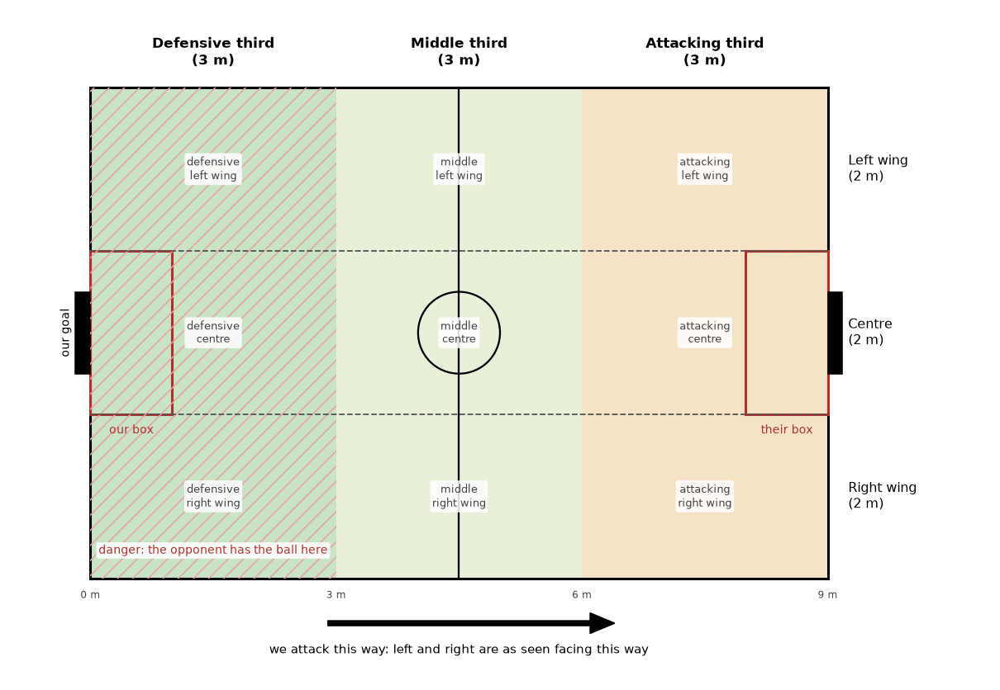

# Pitch zones

Names for the parts of the pitch, so that people, agents, docs and code mean the same place.
Every zone is defined from one team's point of view: "defensive" is near that team's own goal,
"left" is on its left as it faces the goal it attacks. Measurements are for the standard 9 × 6 m
field (`STANDARD_FIELD_DIMS`).

(Drawn by `docs/img/pitch_zones/make_pitch_zones.py`.)

## Along the pitch: thirds

| Name | Where | In code |
|---|---|---|
| **Defensive third** | the 3 m nearest our own goal line | `ball_zone()` returns `"own"`; `MatchStats` robot zone time `"defensive"` |
| **Middle third** | 3 to 6 m from our goal line, either side of halfway | `"mid"` in both |
| **Attacking third** | the 3 m nearest the goal we attack | `ball_zone()` returns `"final"`; `MatchStats` `"attacking"`, `attacking_third_entries` |

Each third is a third of the pitch length, measured from our own goal line toward the goal we
attack. On the standard field the boundaries are at |x| = 1.5 m. Say "defensive" and
"attacking" rather than "own" and "final"; the code's `own`/`final` are older spellings of the
same thirds.

**Our half / their half**: either side of the halfway line.

## Across the pitch: wings and centre

| Name | Where |
|---|---|
| **Left wing** | the 2 m strip along the touch line on our left as we attack |
| **Centre** | the 2 m strip down the middle, as wide as the box, so it runs straight at both goals |
| **Right wing** | the 2 m strip along the touch line on our right |

The centre is |y| ≤ 1 m (the box's half width). Left and right turn with the team: for a team
attacking toward +x, its left wing is y > 1 m; for a team attacking toward −x (`my_team_is_right`),
its left wing is y < −1 m. So the two teams' left wings are on opposite touch lines.

The scenario bench tags each start with its third and lane (`start.start_tags`, `--where`);
no tactic uses the lanes yet, and one that needs them should use these boundaries.

**Ball side / far side**: the wing the ball is on, and the wing opposite it. When the ball is in
the centre, neither applies. **Weak side** is not the same thing: in `SwitchOfPlayTactic`
(`_weak_side`) it is the half of the pitch, split at y = 0, with fewer opponents in it, wherever
the ball is.

## Cells

A third and a strip together name one of nine cells: "attacking left wing", "defensive centre".

## Areas the rules define

- **The box**: the defense area, 1 m deep and 2 m wide in front of each goal. At most one
  defender (the goalkeeper) may be inside its own box, and attackers may not enter the
  opponent's (`custom_referee/rules/defense_area_rule.py`). "Our box" and "their box" are from
  the team's point of view. Code calls it the defense area (`FieldDimensions.right_defense_area`).
- **The goal**: 1 m wide.
- **The centre circle**: 0.5 m radius; it matters at kickoffs.

## Words with a fixed meaning

- **Danger**: the opponent has possession with the ball in our defensive third in live play.
  Possession is the team's: a pass between two opponents, or their shot, stays theirs until we
  touch the ball. The signal
  `danger_s` counts the seconds of it (`analysis/chances.py`; see [signals.md](signals.md)).
  Don't use "danger" for anything else.
- **Clearance condition**: when `ClearBallTactic` clears (`clear_ball.in_danger`): the ball within
  2.6 m of our goal line and an opponent within 1.2 m of it. It is narrower than danger; the function's
  name predates this doc.
- **Entry**: the ball crossing into a team's attacking third, whoever touched it last
  (`attacking_third_entries`). Once in, it has to come back 0.3 m behind the line before it can
  count again.
