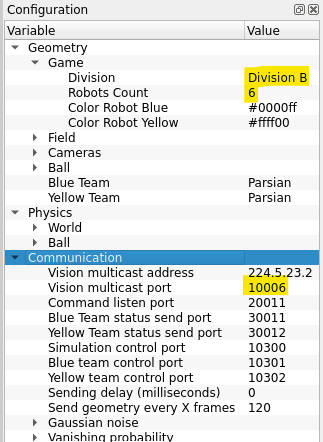

# External setup: grSim, GameController, AutoReferee, SSL Vision

None of this is needed for everyday work: rsim and the in-process
[`CustomReferee`](custom_referee.md) run everything headless with no external process, and
behave the same across rsim, grSim and real mode. Set these up only to run against grSim, the
official competition software, or real robots.

## grSim

1. Go to the [grSim repo](https://github.com/RoboCup-SSL/grSim) and follow its
   [installation steps](https://github.com/RoboCup-SSL/grSim/blob/master/INSTALL.md).
2. Change the configuration to the values highlighted below:

   

3. To run it, execute `./bin/grSim` in the cloned repo.

## AutoReferee and the GameController

1. Make sure `grSim` is set up and can be called from a terminal.
2. `git clone` the [AutoReferee repo](https://github.com/TIGERs-Mannheim/AutoReferee) into a
   folder named `AutoReferee/` in the repository root.
3. Change `DIV_A` to `DIV_B` in `AutoReferee/config/moduli/moduli.xml`:

   ```xml
       <globalConfiguration>
           <environment>ROBOCUP</environment>
           <geometry>DIV_B</geometry>
       </globalConfiguration>
   ```

4. Get the latest [compiled game controller](https://github.com/RoboCup-SSL/ssl-game-controller/releases/),
   rename it to `ssl-game-controller`, and save it in a `ssl-game-controller/` directory in the
   repository root.

Both directories are gitignored.

### Starting the external test environment

Only needed to test against the official referee software; the in-process `CustomReferee`
needs none of this. With grSim, the GameController and AutoReferee set up, start each in its
own terminal from the repository root:

```bash
grSim
cd ssl-game-controller && ./ssl-game-controller
cd AutoReferee && ./gradlew run
```

Then run your own strategy. The GameController's web UI is at http://localhost:8081/#/match
(this repo's dashboard is :8080).

## SSL Vision for real testing (WSL)

1. Connect the vision Linux laptop and your own laptop to the same network (an external
   hotspot).
2. Allow inbound UDP packets through the vision port. With admin privileges, in PowerShell:

   ```
   New-NetFirewallRule -DisplayName "Allow Multicast UDP 10006" -Direction Inbound -Protocol UDP -LocalPort 10006 -Action Allow
   ```

3. Type `%USERPROFILE%` into Windows + R and add a `.wslconfig` file there (file type
   WSLCONFIG):

   ```
   [wsl2]
   networkingMode=mirrored
   ```

4. Restart WSL with `wsl --shutdown`, then check the connection:

   ```
   sudo tcpdump -i eth1 -n host 224.5.23.2 and udp port 10006
   ```

   If you see UDP packets, everything is working.

For the robot radio and controllers see
[`utama_core/team_controller/README.md`](../utama_core/team_controller/README.md).
