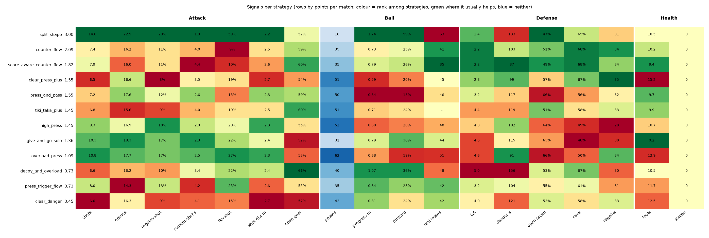
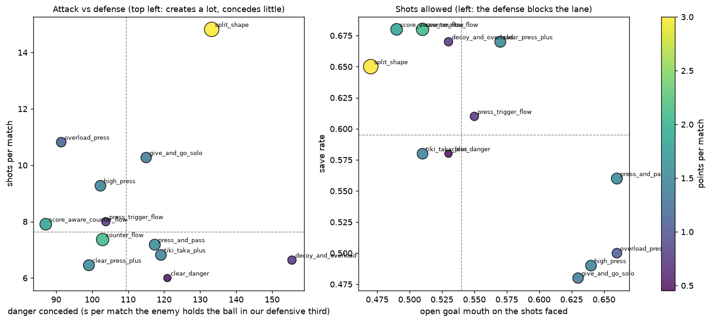
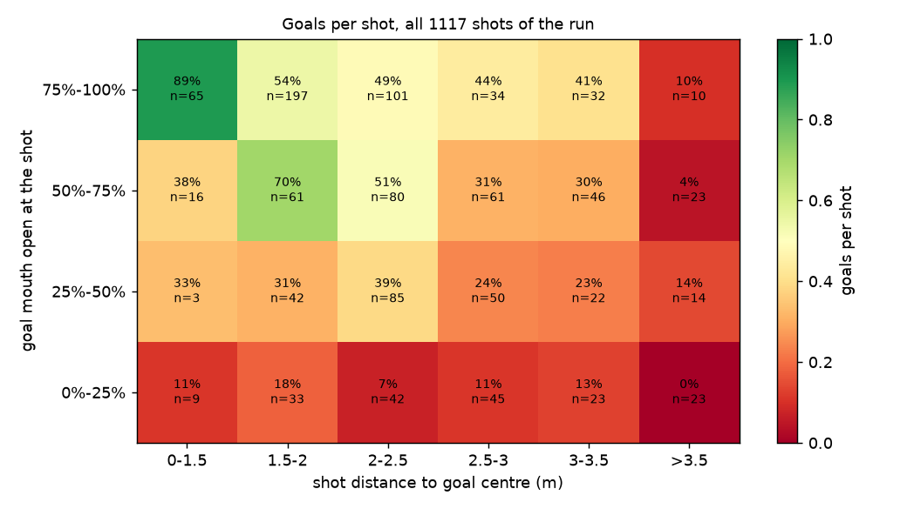
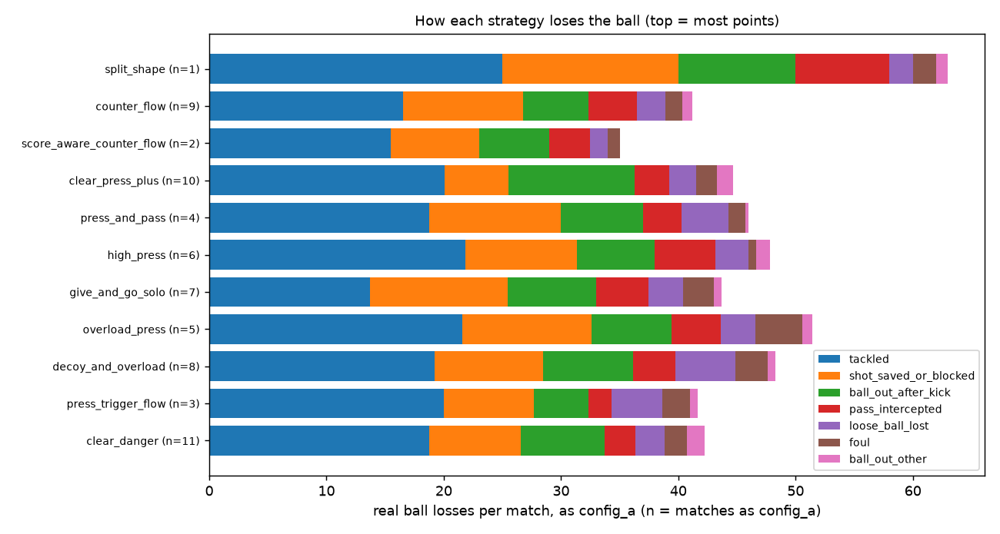
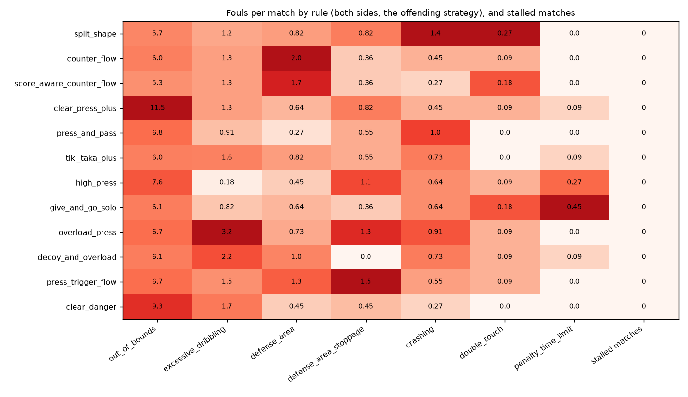

# Signal report

What each strategy does well and badly, from the signals in [`signals.md`](signals.md), drawn
from one round-robin. Standings are in [`strategies.md`](strategies.md); this shows why.

**Run:** `tournament_20261010_090819` (strategy-guard at `a17e2791`, the 12 non-retired configs,
66 matches of 600 s). Regenerate the figures after a new full round-robin, then rewrite the notes:

    pixi run python tools/signal_report.py replays/tournament_<id>

Signals explain results; none is a target. A red cell is a place to look, not a thing to tune
away.

## Every strategy at a glance

Rows by points per match (the number after each name). Each column is coloured by rank among the
12 strategies, green where the value usually helps; passes are blue because more is neither
better nor worse. The printed number is the real value: per match, or a share.

- **`split_shape` is green across attack**: most shots (14.8) and entries (22.5), a shot after
  20% of its regains (1.9 s on average) and after 59% of its free kicks, 1.74 m gained per pass
  from the fewest passes (18). Its weak side is defense: 133 s a match of danger conceded, second
  most, and the most real ball losses (63).
- **`counter_flow` and `score_aware_counter_flow` win by conceding little**: the fewest goals
  against (2.2) and the least danger (103 and 87 s), with few shots of their own.
- **The pressers shoot a lot and still lose.** `high_press`, `give_and_go_solo` and
  `overload_press` make 9–11 shots a match, but concede 4.3–4.6 goals: the shots they face are
  open (63–66%) and they save half.
- **`press_and_pass` passes for nothing**: 50 passes, 0.34 m gained each, 13% forward.
- **`decoy_and_overload` gains ground passing (1.07 m, 36% forward) and concedes the most**:
  5.0 goals and 156 s of danger a match.
- **`clear_danger` is last with no red flag in defense**: it shoots least (6.0), from furthest
  (2.7 m), at the least open goal (52%). It defends adequately and doesn't create.

## Attack against defense

Left: shots created against seconds the enemy holds the ball in the strategy's defensive third.
Only `split_shape` creates far more than the rest; it does so while conceding more danger than
most. `overload_press` creates 10.8 shots while conceding the second least danger (91 s), yet
finishes ninth: its losses are in the right panel.

Right: how open the shots a strategy faces are, against its save rate. Every strategy fields the
same keeper, so this is the defense in front of it. The pressers (`high_press`, `overload_press`,
`give_and_go_solo`, `press_and_pass`) are bottom right: they leave the lane open (63–66%) and
save about half. `split_shape`, `counter_flow` and `score_aware_counter_flow` are top left: the
lane is blocked (47–51%) and the keeper saves 65–68%.

## What makes a shot score

All 1117 shots of the run. Inside 1.5 m with three quarters of the goal open, 89% score; with
under a quarter open, at most 18% do at any distance, and past 3.5 m at most 14%. So shot distance
and open goal mouth measure chance quality, and a strategy's conversion follows from where it
shoots, not from luck. Every shot here is already on target (`MatchStats`' detector), which is
why the rates are high.

## How each strategy loses the ball

Real ball losses per match (not won back within 1 s), measured as config_a only: `n` is how many
matches that is. In a round-robin config_a is the earlier name, so `split_shape` (1),
`score_aware_counter_flow` (2) and `press_trigger_flow` (3) rest on very little, and
`tiki_taka_plus` has none.

- **Being tackled is everyone's largest loss**, 14–25 a match: carrying into pressure.
- **`clear_press_plus` kicks the ball out most** (about 11 a match), its second largest loss; it
  also commits the most out-of-bounds fouls below.
- Shots saved or blocked are a loss too, so the strategies that shoot most (`split_shape`,
  `give_and_go_solo`, `overload_press`) lose more that way; that one is a cost of attacking.

## Fouls and stalls

Fouls per match by the offending strategy, colour scaled per column, and the stalled matches it
played in (each stall counts for both teams). No match stalled in this run.

- Out of bounds is the most common foul everywhere; `clear_press_plus` (11.5) and `clear_danger`
  (9.3), the two with a clearance valve, are the outliers.
- `overload_press` (3.2) and `decoy_and_overload` (2.2) dribble too far: both run
  `DecoyOverloadTactic`.
- `counter_flow` (2.0) and `score_aware_counter_flow` (1.7) enter the defense area most, and
  `split_shape` crashes into robots most (1.4).
